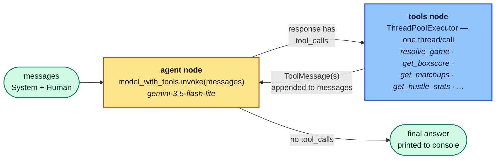

# nba-live-agent

[](https://www.python.org/downloads/)
[](https://langchain-ai.github.io/langgraph/)
[](https://ai.google.dev/gemini-api)
[](https://fastapi.tiangolo.com/)
[](https://streamlit.io/)
[](LICENSE)

A CLI agent that reasons about a live or historical NBA game using a hand-built LangGraph ReAct loop (Gemini + tool calling) over the `nba_api` data feeds, with optional expert commentary pulled from X. You name the game you're watching once at the start of a session; from then on you ask questions like "why isn't LeBron scoring this quarter?" and it pulls play-by-play/boxscore data and gives a causal answer, not a stat dump.

## Demo

🎥 Coming soon.

## Setup

```bash
python3.11 -m venv .venv   # 3.11/3.12 recommended over very new Python releases
source .venv/bin/activate
pip install -r requirements.txt
cp .env.example .env       # fill in GOOGLE_API_KEY (required); X_BEARER_TOKEN is optional
```

Without `X_BEARER_TOKEN`, `get_x_expert_insights` is unavailable and returns an error status.

## Run

```bash
python run.py                  # interactive session, X commentary off
python run.py --verbose        # also print DEBUG-level logs to the console
python run.py --x-commentary   # enable get_x_expert_insights
```

**`get_x_expert_insights` is opt-in, off by default**, independent of whether `X_BEARER_TOKEN` is configured. Pass `--x-commentary` explicitly when you want it.

## Web app (FastAPI + Streamlit)

The same agent is also available as a chat web app: a stateless FastAPI backend wraps the LangGraph loop, and a Streamlit frontend talks to it over HTTP.

```bash
python run_web.py   # starts both, one command; Ctrl+C stops both
```

Or run them separately (e.g. for `--reload` during backend development):

```bash
# Terminal 1 — backend
PYTHONPATH=src uvicorn nba_live_agent.api:app --reload --port 8000

# Terminal 2 — frontend
streamlit run streamlit_app.py
```

`streamlit_app.py` calls `http://localhost:8000` by default; override with `NBA_AGENT_API_URL` if the backend runs elsewhere.

FastAPI holds no session state — the resolve-phase conversation is round-tripped through Streamlit's `st.session_state`, while each QA question is answered fresh with no history (mirroring the CLI). The sidebar's "New session" button resets everything.

## Test

```bash
pytest
flake8
```

## How it works

Two-node LangGraph loop:



- **`agent` node** — Gemini (via `langchain-google-genai`) with tools bound. Given the running message history, decides whether to call a tool or produce a final answer.
- **`tools` node** — executes whichever tool(s) the `agent` node requested, in parallel (via a thread pool) when the model requests more than one.

At session start you name the game (e.g. "Lakers vs Celtics", or a specific date for a past game); `resolve_game` resolves this once and the resulting `game_id` is held as context for every subsequent question in the session — the model doesn't re-resolve the game per question.

### Tools

- `resolve_game(query, date=None)` — free text → `game_id` + both team names. Date defaults to unset, which searches a 5-day window (today ± 2 days) so the model doesn't have to guess an exact date from relative phrasing; pass `date="YYYY-MM-DD"` only when the user names one explicitly. Returns a structured "not found" / "ambiguous" result (candidates tagged with their date) rather than guessing.
- `get_play_by_play(game_id, period=None)` — chronological events, optionally scoped to one period.
- `get_boxscore(game_id)` — current live stats snapshot for every player.
- `get_matchups(game_id, player_name)` — per-defender breakdown of who guarded a given player.
- `get_hustle_stats(game_id)` — screen assists, deflections, charges drawn, box outs, contested shots, loose balls recovered.
- `get_x_expert_insights(query)` — qualitative tactical commentary from a curated list of NBA analysts on X, for context raw stats don't explain. Real-time/recent games only — see [X commentary](#x-commentary) below. Opt-in via `--x-commentary` — see [Run](#run).

`nba_client.py` retries each `nba_api` call with backoff and falls back from the live feed to the historical stats feed when the live feed doesn't have a game anymore. All of this is decoupled from LangGraph — it's plain functions returning status dicts.

### Data source

[`nba_api`](https://github.com/swar/nba_api) — free, open-source wrapper around NBA.com's data feeds. It's unofficial and technically against NBA.com's terms of use.

### NBA.com API Reliability & Rate Limits

`stats.nba.com` sits behind Akamai anti-scraping protections and can randomly block, rate-limit, or tarpit requests (`ReadTimeout` / `HTTP 403`) — see [swar/nba_api#176](https://github.com/swar/nba_api/issues/176). This is an NBA.com upstream issue, not a bug in `nba-live-agent`.

Mitigations: header spoofing, exponential backoff retries, socket timeouts (`timeout=5`), and routing primarily through the more reliable `live.nba.com` with `stats.nba.com` as fallback.

### X commentary

`get_x_expert_insights` calls X API v2's `search/recent` endpoint, which only searches posts from the **last ~7 days** — real-time and recent games only, not a historical archive. Older games return no results even with a valid `X_BEARER_TOKEN`.

## Logging

By default the CLI prints only its own status/answer output; console logging stays at `WARNING`. Pass `--verbose`/`-v` to also print `DEBUG`-level logs (tool calls, retries, fallbacks) to the console. A `nba_live_agent.log` file (gitignored) always captures full `DEBUG` detail regardless of verbosity, for after-the-fact troubleshooting. See `src/nba_live_agent/logging_config.py`.

## Project layout

- `src/nba_live_agent/nba_client.py` — plain wrapper functions around `nba_api`
- `src/nba_live_agent/x_client.py` — X (Twitter) expert-commentary client, with mock fallback
- `src/nba_live_agent/models.py` — Pydantic schemas (`GameResolution`, `PlayEvent`, etc.)
- `src/nba_live_agent/tools.py` — LangGraph-bindable `@tool` functions
- `src/nba_live_agent/agent.py` — the hand-rolled agent/tools LangGraph loop
- `src/nba_live_agent/session.py` — resolve/QA prompt building and turn orchestration shared by `cli.py` and `api.py`
- `src/nba_live_agent/cli.py` — interactive CLI session loop
- `src/nba_live_agent/api.py` — FastAPI backend for the web app
- `streamlit_app.py` — Streamlit frontend for the web app (repo root, talks to `api.py` over HTTP)
- `run_web.py` — starts both the FastAPI backend and Streamlit frontend with one command
- `src/nba_live_agent/logging_config.py` — logging setup (`--verbose`, log file)
- `tests/` — unit tests: mocked `nba_api`/X calls, error-handling and fallback paths, log-record assertions, and (`test_api.py`) the FastAPI endpoints with a mocked graph

## Deploying

`render.yaml` defines two free [Render](https://render.com) web services — the FastAPI backend and the Streamlit frontend — as a Blueprint, so both deploy together from one connection to this repo.

In the Render dashboard, **New → Blueprint**, connect this repo, then set env vars: on `nba-live-agent-api`, `GOOGLE_API_KEY` (required; optionally `X_BEARER_TOKEN`); on `nba-live-agent-web`, `APP_PASSWORD` (required, otherwise anyone with the URL can spend your API quota). Every push to `main` auto-redeploys both.
